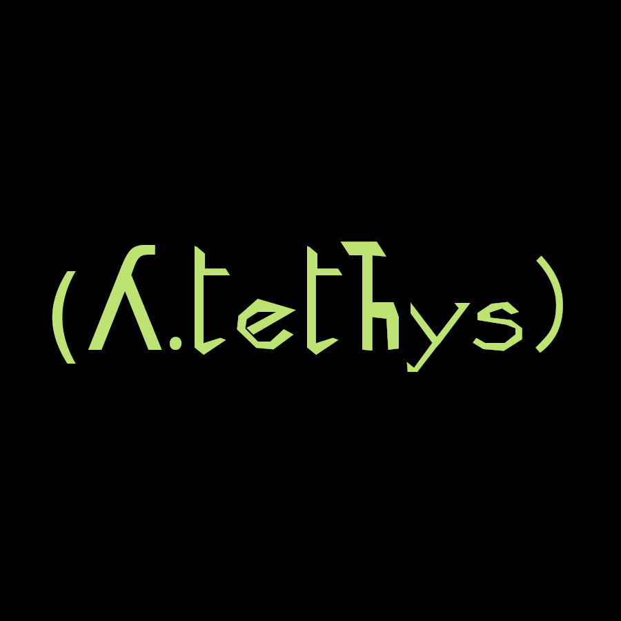
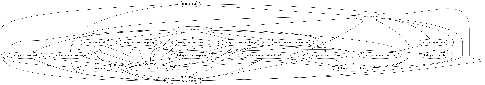

# design 

## metis lessons learnd
[metis](https://gitlab1.ptb.de/vaclab/metis) uses redis as the state
image. An unpleasant side effect is the need of a constant `loc` (map)- `key`
transformation (`map->key`, `key->map`).

The hope that the redis database will be perceived
as a platform for docking further programs (GUI, Metic, evaluation,
data mining, alarm system, bots, ki) is wishful thinking. so why all
the `map->key`, `key->map` time loss.

Part of metis debuging was related to a redis gui with all it pros and
cons. The _tethys_ system should be inspectable in total with the clojure REPL.

Furthermore, [portal](https://github.com/djblue/portal) is a realy
nice option to understand the system during runtime.

* no use of an (in-mem)-database at the first place
* state, exchange, model **can be pulled into an inmutable (clock
  ordered) database system snapshots
* a loop recur makes the progress (turn based) which simplifies a lot

## system

* the system maintained by
  [integrant](https://github.com/weavejester/integrant)
  
  
# generate documentation

```shell
clojure -M:docs
```

# generate namespace graph

```shell
clj -X:hiera
```


