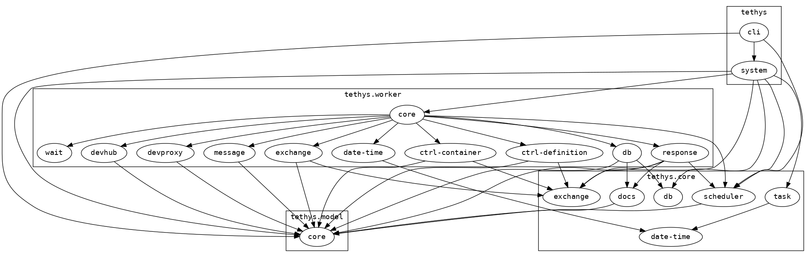

# design 

## metis lessons learnd
[metis](https://gitlab1.ptb.de/vaclab/metis) uses redis as the state
image. An unpleasant side effect is the need of a constant `loc` (map)- `key`
transformation (`map->key`, `key->map`).

The hope that the redis database will be perceived
as a platform for docking further programs (GUI, Metic, evaluation,
data mining, alarm system, bots, ki) is wishful thinking. so why all
the `map->key`, `key->map` time loss.

Part of metis debuging was related to a redis gui with all it pros and
cons. The _tethys_ system should be inspectable in total with the clojure REPL.

Furthermore, [portal](https://github.com/djblue/portal) is a realy
nice option to understand the system during runtime.


## system

* the system maintained by
  [integrant](https://github.com/weavejester/integrant)
* Idea: integrant provides [suspend and resume](https://github.com/weavejester/integrant#suspending-and-resuming)
  which can be used dump the system into a database or filesystem
  etc. and resume at any point in time

# development

## launch clj and compile

Ensure classes folder exist:
```shell
mkdir -p target/classes
```

```shell
clj -A:dev
```

```clojure
(set! *compile-path* "target/classes")
;; => "target/classes"
(compile 'tethys.cli) 
(start)
;; => {:ctrl :run}
(c-run :mpd-ref 0)
;; => ":mpd-ref.:conts.0.0.0"
;;    ":mpd-ref.:conts.0.0.1"
;;    ":mpd-ref.:conts.0.1.0"
;;    ":mpd-ref.:conts.0.1.1"
;;    ":mpd-ref.:conts.0.1.2"
;;    ":mpd-ref.:conts.0.1.3"
;;    ":mpd-ref.:conts.0.2.0"
```


## spawn nrepl and connect from somewhere

```shell
clj -A:dev -m nrepl.cmdline --middleware "[cider.nrepl/cider-middleware]"
```
The connection port is stored in the file `.nrepl-port` in pwd. 
To connect to system with  **CIDER** (Emacs) use  `M-x` cider-connect `RET`

> CIDER will prompt you for the host and port information,...

[see cider manual](https://docs.cider.mx/cider/basics/up_and_running.html#connect-to-a-running-nrepl-server)

## generate documentation

```shell
clojure -M:docs
```

## find outdated deps

```shell
clojure -M:outdated
```

# generate namespace graph

```shell
clj -X:hiera
```





# ELS

kibana > Management > DevTools

```
PUT /tethys_log
```

## show in kibana

Management > Kibana > Index Patterns
`http://<host>:5601//app/management/kibana/indexPatterns`
--> create index pattern


## logging order accuracy

https://github.com/BrunoBonacci/mulog/issues/76

**Q:** Is it possible to configure higher timestamp accuracy to maintain logging order?

**A:** If you are interested in the relative order of events within the same JVM, then the easiest option is to sort by :mulog/trace-id

**Here is how:** Add field to index with script:

```
emit(doc['mulog/trace-id.keyword'].value)
```
